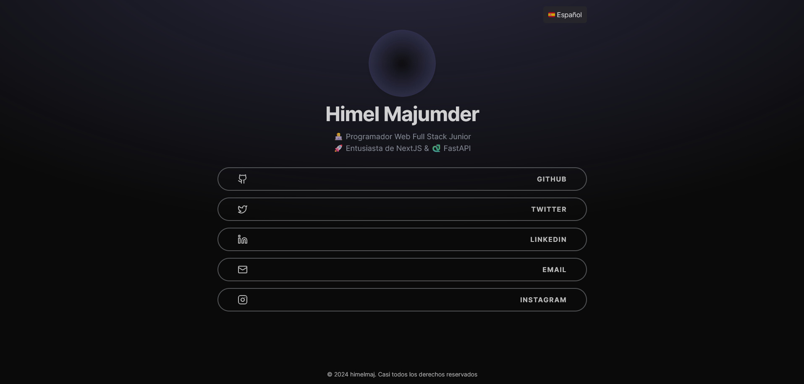

<h1 align="center">🌲 Linktree Himel</h1>

<h3 align="center">Simple site to group all my profiles on social networks in one place.</h3>

## ✨ Features

- **User-Friendly Interface**: Designed to be intuitive and easy to use.
- **Customization**: Allows users to customize the appearance of their link page.
- **Responsive**: Adapts to any device, ensuring an optimal experience on both mobile and desktop.
- **Built with Astro Build**: Utilizes the latest technologies from Astro for better performance and maintenance.

## 📸 Screenshots



## 🛠 Technologies Used

- **Astro Build**: Framework for building fast and modern websites.
- **CSS/Tailwind CSS**: For design and layout.
- **JavaScript**: For functionality and interactivity.
- **Node.js**: For backend and dependency management.

## 🚀 Getting Started

1. **Clone this repository:**

   ```bash
   git clone https://github.com/himelmaj/himelmaj-bio.git
   cd himelmaj-bio/
2. **Install dependencies:**
   ```bash
    npm install
3. **Start the development server:**
   ```bash
    npm run dev
## 📝 License

This project is under the MIT license. See the [LICENSE](LICENSE) file for more details.

---

Made with ❤️ by Himel Majumder [Get in touch](https://himelmaj-bio.vercel.app/)